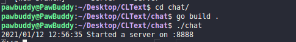
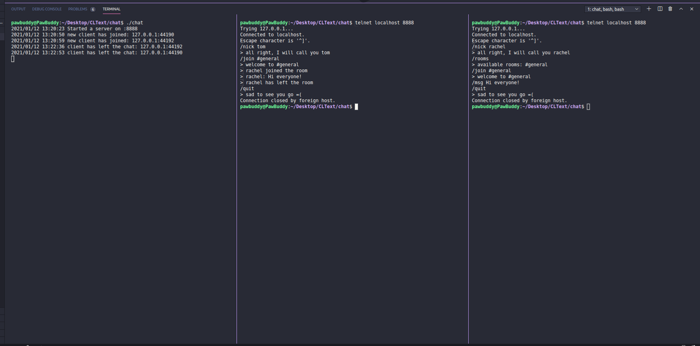

[]

# What is CLText?

CLText is a CLI messaging service built using Go-Lang. It uses a TCP connection.
The whole application is built upon:-

- client: current user and its connection
- room
- command: from the client to the server
- server: which manages all incoming commands, as well it stores rooms and clients
- TCP server itself to accept network connections

# Commands

Kindly refer to the [Wiki](https://github.com/PawBud/CLText/wiki)

# Install & Run
**These Instructions are for Linux Ubuntu**
1. Install the source code 
2. open the directory in your IDE and run `cd chat/`
3. run `go build .` which builds an executable in the chat directory itself
4. run `./chat` which runs the exectuable. Now the server should start

**These Instructions are for MacOS**
1. Install [homebrew](https://brew.sh/).
2. run `brew install telnet`.
3. The remaining steps are same to that of Ubuntu which are aforementioned.

## Commands in Use

## Licence
This package is licensed under MIT license. See LICENSE for details

Feel free to issue a PR anytime if you feel that the changes can improve the application's functionality.
